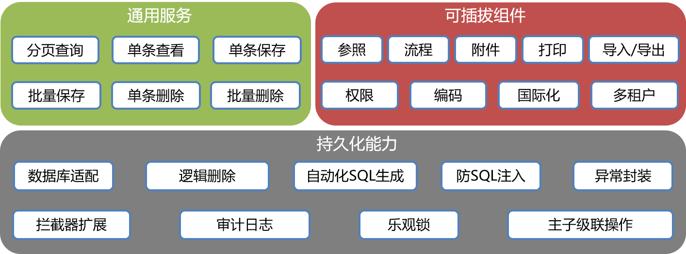

# 概述
   
> iuap-pap-baseservice框架属于iuap快速开发体系中的后台支持部分，通过与iuap前端开发框架结合,可快速的实现一套业务表单系统开发.

### 特性
* 集成图形化快速建模工具——[开发者中心](https://developer.yonyoucloud.com/)
* 快速启动业务表单开发
* 简化单表/主子表CRUD服务开发及通用性的持久化能力
* 简化iuap参照组件集成
* 提供iuap应用平台组件(流程、多租户、编码规则、打印、导入导出、附件、数据权限)可插拔式集成
* 简化[tinper](http://tinper.org/)前端组件集成
### 功能架构


### 安装及快速开始
> 示例工程仅展示了主子表通用服务能力，可插拔的组件能力需要依赖iuap应用平台
#### 环境依赖
本示例依赖配置好的maven+git环境，并且在maven的setting.xml中添加相应的repository
``` xml
<repository>
    <id>iUAP-Snapshots</id>
    <name>iUAP-Snapshots</name>
    <url>http://maven.yonyoucloud.com/nexus/content/repositories/iUAP-Snapshots/</url>
    <releases>
        <enabled>false</enabled>
    </releases>
    <snapshots>
        <enabled>true</enabled>
    </snapshots>
</repository>
<repository>
    <id>iUAP-Stagings</id>
    <name>iUAP-Stagings</name>
    <url>http://maven.yonyoucloud.com/nexus/content/repositories/iUAP-Stagings/</url>
    <releases>
        <enabled>true</enabled>
    </releases>
    <snapshots>
        <enabled>false</enabled>
    </snapshots>
</repository>
```

#### 运行示例
下载源码
```bash
git clone https://github.com/sungine/iuap-pap-baseservice-demo.git
cd iuap-pap-baseservice-demo
```
打开工程

运行sql

启动服务
